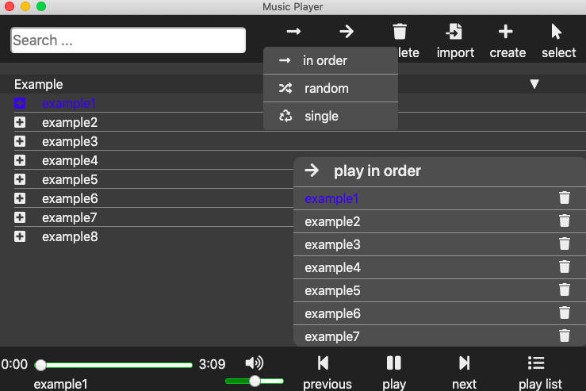

# LifeJournal
Have you ever tired of switching among your album, note, music, and calendar apps in your desktop? The LifeJournal combine them all to give you more convinience to keep track of your daily basis. 

## Installation
The LifeJournal is built on the top of [electron](https://electronjs.org/docs/tutorial/installation) and [node.js](https://nodejs.org/en/download/). Run theses command lines below to install the external libraries after you install node.js and electron.

```bash
npm install jquery
npm install bootstrap
```

## Login System
* Allow different users to have their on database.
* Data encryption.


## Journal Entry
* Orginize your journal by date.
* Search for your journal by keyword.
* Upload your photos assciated your journal.


## Calendar and Reminder
* Reminder you of upcoming events.
* Access to your journal.


## Album
* Manage your photos.


## Music
* play your local music.

## Theme
* Blue theme
* Dark theme
* Light theme




